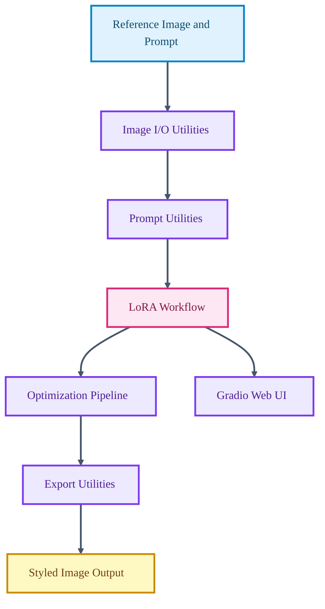

# StyleSync AI

<p align="center">

  
  
  
  
</p>

<p align="center">
  <strong>A visual style-transfer toolkit for training and applying LoRA-based style adaptation workflows.</strong>
</p>

StyleSync AI provides a practical pipeline for synchronizing visual style across generated or edited images. It includes command-line and web interfaces, image I/O utilities, LoRA handling, prompt helpers, optimization code, and export workflows.

## Core Capabilities

- Runs style-transfer workflows through command-line and web UI entry points.
- Handles image loading, processing, prompt utilities, and export logic.
- Integrates LoRA-based adaptation utilities.
- Supports interactive experimentation through Gradio.

## Technical Architecture

The package separates image I/O, prompt construction, LoRA utilities, optimization, export behavior, and web UI logic. Thin runner scripts expose the workflow for local use.

## Architecture Diagram



## Technology Stack

- PyTorch and diffusers ecosystem for generative image workflows.
- Transformers, accelerate, and xformers for model execution support.
- Gradio for the local web interface.
- Pillow and tqdm for image handling and workflow feedback.
- Package-style Python module organization under stylesync.

## Repository Structure

- `run_stylesync.py` - CLI workflow entry point.
- `run_web_ui.py` - Interactive web UI runner.
- `stylesync/lora_utils.py` - LoRA helper utilities.
- `stylesync/optimization.py` - Optimization workflow.
- `stylesync/image_io.py` - Image input/output helpers.
- `requirements.txt` - Python dependencies.

## Getting Started

```bash
python -m venv .venv
source .venv/bin/activate
pip install -r requirements.txt
```

```bash
python run_web_ui.py
```

## Professional Context

This project demonstrates applied computer vision, model-workflow packaging, and user-facing experimentation tooling.
